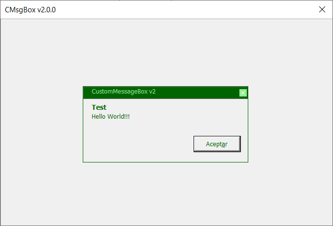

# CustomMsgboxClass

> An alternative Message Box for Excel, for use with VBA macros on UserForms.

## Definition
CustomMsgboxClass is a VBA Class file (.cls) with wich is easy to generate a fast Message box, friendly and enabled just for UserForms with macros.

> It is necessary to have basic knowdlements about VBA Class programation (OOP, Object Otiented Programming).

It works under MS Excel version 2007+. No installation required, just import to your VBA Project.

As CustomMsgboxClass is a VBA Class, it needs to be instanciated as an Object and then use its methods and properties interface.

## Use Mode
  1.  [Download CustomMsgboxClass.cls](https://github.com/Roccouu/CustomMsgboxClass/tree/master/project-dist/CustomMsgboxClass_v2.cls) file.
  2.  Create a new Excel enabled for macros workbook.
  3.  Open the VBA Editor with **Ctrl+F11**
  4.  Go to ***File > Import File*** menu or press ***Ctrl+M*** and then search your **CustomMsgboxClass.cls** downloaded file and import it to the VBA Project.
  5.  You can create a new Module and a new Form where ***CustomMsgboxClass*** will be used (also you can download the [custommsgboxexampleuse.xlsm](https://github.com/Roccouu/CustomMsgboxClass/tree/master/project-dist/custommsgboxexampleuse.xlsm) file to see a practical and easy ways of use ***CustomMsgboxClass***).
  6.  Call one of the two methods of the Object, and...
  ``` vb
    Dim msg As New CustomMsgboxClass

    Call msg.CMsgBox("Hello world!!!", "CustomMessageBox_v2", "Test", cMsgButtons:=cmbOKOnly, cUFrm:=Me)
  ```
  
  ``` vb
    Dim msg As New CustomMsgboxClass

    Call msg.CMsgBox("Hello world!!!", "CustomMessageBox_v2", "Test", cUFrm:=Me)
  ```
  
  ``` vb
    Dim msg As New CustomMsgboxClass

    Call msg.CMsgBox("Hello world!!!", "CustomMessageBox_v2", "Test", cmbSuccess, cUFrm:=Me, cAspect:=cmbFluid)
  ```
  
  ``` vb
    Dim msg As New CustomMsgboxClass

    Call msg.CMsgBox("Hello world!!!", "CustomMessageBox_v2", "Test", cUFrm:=Me, cAspect:=cmbTagLine)
  ```
  

  7.  Enjoy CustomMsgboxClass!

## About the ***CustomMsgboxClass's*** Methods:

### CustomMsgboxClass Version 2.0.0 (recommended)
  Second verion of ***CustomMsgboxClass*** has a hight optimization level.
  
  Now, the class just has one method and all its parameters are optionals:

  ***Method CMsgBox:*** has fourteen parameters:
  - **cMsg** As String = VBA.vbNullString: The message, a text string.
  - **cTitle** As String = "CustomMsgboxClass": The title, a text string.
  - **cSubtitle** As String = VBA.vbNullString, The subtitle, a text string.
  - **cMsgType** As CMB_MsgType = cmbDefault: A VBA enumeration that can holds any of this values:   *cmbDefault, cmbError, cmbSuccess, cmbInfo, cmbQuestion, cmbAlert*, depending wich is selected, ***CustomMsgboxClass*** will show an icon respectively, default value is *cmbDefault*, no icon.
  - **cMsgButtons** As CMB_ControlButtons = cmbNoButtons: A VBA enumeration that can holds any of this values: *cmbNoButtons, cmbOKOnly, cmbClose, cmbCancel*, will show a button to any event respectively. default value is *cmbNoButtons*, no buttons.
  - **cUFrm** As MSForms.UserForm: A UserForm that holds the object *CMsgbox*.
  - **cCtrlTargetName** As String = VBA.vbNullString: A string. Is the name of the control, around which *CMsgBox* object will be shown or will highlight depending its status.
  - **cCtrlSourceName** As String = VBA.vbNullString: A string. Is the name of the control, that calls the *CMsgBox* object, usually a button with  usually a button whose visibility will be blocked to avoid recursive calls.
  - **cCtrlRequired** As CMB_ControlRequired = cmbNoRequired: A VBA enumeration that can holds any of this values: *cmbNoRequired, cmbRequired*, if control *cCtrlTargetName* must validate any data, the *CMsgBox* object will highlights that control with an identifiying color according of its status (error, info, etc.). default value is *cmbNoRequired*, no required.
  - **cPositionX** As CMB_ControlPositionX = cmbCenter: A VBA enumeration that can holds any of this values: *cmbCenter, cmbLeft, cmbRight*, puts *CMsgBox* at left, right or center of the UserForm horizontal axis or around the control *cCtrlTargetName*. default value is *cmbCenter*, center.
  - **cPositionY** As CMB_ControlPositionY = cmbMiddle: A VBA enumeration that can holds any of this values: *cmbMiddle, cmbTop, cmbBottom*, puts *CMsgBox* up, down or middle of UserForm vertical axis or around the control *cCtrlTargetName*. by default *cmbMiddle*, middle.
  - **cTheme** As CMB_ColorIndex = cmbGreenDefault: A VBA enumeration that can holds any of this values: *cmbGreenDefault, cmbPurple, cmbMaroon, cmbBlack*, place the chosen theme for *CMsgBox*. By default *cmbGreenDefault*, green *CMsgBox*.
  - **cDuration** As CMB_MsgDuration = cmbNoTime: A VBA enumeration that can holds any of this values: *cmbNoTime, cmb3Seconds, cmb4Seconds, cmb5Seconds*, establishes a limited time to show the *CMsgBox* object, min 3 seconds. By default *cmbNoTime*, asynchronous. *When *CMsgBox* has, a limited time no buttons will appear in its interface.*
  - **cAspect** As CMB_MsgBoxAspect = cmbPopupDefault: A VBA enumeration that can holds any of this values: *cmbPopupDefault, cmbPopupAutoclose, cmbFluid, cmbTagLine*, says at *CMsgBox* object: show the selected interface. *cmbPopupDefault*: fixed and asynchronous, *cmbPopupAutoclose*: float and synchronous, by default 3 seconds, *cmbFluid*: fluid in the whole wide of Userform and synchronous, by default 3 seconds, *cmbTagLine*: a floating syncrhonous or asynchronous whose appearance is like a tag label beside the *cCtrlTargetName* control.

---
### CustomMsgboxClass Versión 1.0.0

  A.  ***The CMsgbox Method:*** Allows creation of a popup window type Custom Message Box, it can been show on a UserForm in ***asynchronous*** mode (no limit time) or ***synchronous*** mode (just for a previously established time); synchronous mode draws a button that allows user to close popup when himself decides, with th synchronous mode, the popup will close itself after a time predefined by programmer (by default, it is shown per three seconds and it can be showed ten seconds at max) without show th close button.
  The method has many parameters, most of them optionals.
  ```vb
        CMsgbox( _
          ByVal MFrm As MSForms.UserForm, _
          Optional MMsg As String = "", _
          Optional MMsgType As String = "", _
          Optional MTitle As String = "CustomMsgboxClass", _
          Optional MSubtitle As String = "", _
          Optional MCloseButton As Boolean = False, _
          Optional MPosition As String = "Middle", _
          Optional MControl As Object, _
          Optional MRequiredControl As Boolean = False, _
          Optional MColor As Long = 4616993, _
          Optional MTime As Single = 3)
  ```
  Where:
  1.  **Mfrm: (Required)** It must be an Object type UserForm, where the CustomMsgBox will be draw.
  2.  **MMsg:** It is the main message that we want to show, therefore, it is the content. Default value, an empty string.
  3.  **MMsgType:** It must be a String type data. With this value we can choice the type of CustomMsgbox that we want to show. There are five possible types:

      -  "Error": To show Error Messages.
      -  "Success": To show Success Messages.
      -  "Info": To show Information Messages.
      -  "Question": To show Interrogation Messages.
      -  "Alert": To show Alert Messages.
      -  By default, CustomMsgboxClass uses the system colors without icons and no title bar.

  4.  **MTitle:** It must be a String type data. It is the Message Title, this value will be established on the title bar zone. Default value: "CustomMsgboxClass".
  5.  **MSubtitle:** It must be a String type data. An optional subtitle for the mesaage. Default value: Empty String.
  6.  **MCloseButton:** A Boolean, on True, it shows an close button; it just works on ***asynchronous*** mode. Default value: False.
  7.  **MPosition:** String type parameter. It is the CustomMsgboxClass position on the UserForm's area, there are three possibly positions: *"Top"*, to positioning CustomMsgboxClass at UserForm top, *"Middle"*, at middle, and *"Bottom"*, at UserForm bottom. By default: *"Middle"*.
  8.  **MControl:** Object type MSForms.Control. In case of you decide highlight a data entry control of your UserForm, send with *MControl* parameter the Control of you need to highlight (The Object works with TextBox, ComboBox, ListBox, RefEdit and Label controls), *CustomMsgboxClass* will be showed right at bottom and aligned at the left of the control you assigned (*MPosition* will be ignored), also, the Control will change its back color and its border color while a some seconds, depending of CustomMsgboxClass type you'd established and if you'd confirmed that you want to highlight the indicated Control, then, the styles of the Control will return to its original status. Default value: Nothing.
  9.  **MRequiredControl:** Boolean. Set it at True to confirm that you want highlight the Control you'd send with *MControl*. Default value: False.        
  10. **MColor:** Long data type. Allows to set a theme color to the object CustomMsgboxClass, you can use a Long data type or VBA's function VBA-RGB(RR,GG,BB) to determine the theme color of the Object. Default value: 4616993, (VBA.RGB(33, 115, 70), Excel's application green color)
  11. **MTime:** Single data type. A number between 3 and 10 that allows set a custom time to show the Object CustomMsgboxClass, after that time, the Object will close and destroy itself.

  B.  ***The CMsgboxFluid Method:***  Allows the creation of an CustomMsgboxClass Object, type tape (fluid, expanded across the whole UserForm's width), this object can be show in a UserForm only in a ***syncronous*** mode (along a established time).
  The method has many parameters, most of them optionals.

  ```vb
    CMsgboxFluid( _
      ByVal MFrm As MSForms.UserForm, _
      Optional MMsg As String = "", _
      Optional MMsgType As String = "", _
      Optional MSubtitle As String = "CustomMsgboxClass", _
      Optional MPosition As String = "Middle", _
      Optional MControl As Object, _
      Optional MRequiredControl As Boolean = False, _
      Optional MColor As Long = 4616993, _
      Optional MTime As Single = 3)
  ```
  Where:

  1.  **Mfrm: (Required)** It must be an Object type UserForm, where the CustomMsgBox will be draw.

  2.  **MMsg:** It is the main message that we want to show, therefore, it is the content. Default value, an empty string.

  3.  **MMsgType:** It must be a String type data. With this value we can choice the type of CustomMsgbox that we want to show. There are five possible types:

      -  "Error": To show Error Messages.
      -  "Success": To show Success Messages.
      -  "Info": To show Information Messages.
      -  "Question": To show Interrogation Messages.
      -  "Alert": To show Alert Messages.
      -  By default, CustomMsgboxClass uses the system colors without icons and no title bar.

  4.  **MSubtitle:** It must be a String type data. An optional subtitle for the mesaage. Default value: Empty String.

  5.  **MPosition:** String type parameter. It is the CustomMsgboxClass position on the UserForm's area, there are three possibly positions: *"Top"*, to positioning CustomMsgboxClass at UserForm top, *"Middle"*, at middle, and *"Bottom"*, at UserForm bottom. By default: *"Middle"*.
  
  7.  **MControl:** Object type MSForms.Control. In case of you decide highlight a data entry control of your UserForm, send with *MControl* parameter the Control of you need to highlight (The Object works with TextBox, ComboBox, ListBox, RefEdit and Label controls), *CustomMsgboxClass* will be showed right at bottom and aligned at the left of the control you assigned (*MPosition* will be ignored), also, the Control will change its back color and its border color while a some seconds, depending of CustomMsgboxClass type you'd established and if you'd confirmed that you want to highlight the indicated Control, then, the styles of the Control will return to its original status. Default value: Nothing.

  9.  **MRequiredControl:** Boolean. Set it at True to confirm that you want highlight the Control you'd send with *MControl*. Default value: False.

  10. **MColor:** Long data type. Allows to set a theme color to the object CustomMsgboxClass, you can use a Long data type or VBA's function VBA-RGB(RR,GG,BB) to determine the theme color of the Object. Default value: 4616993, (VBA.RGB(33, 115, 70), Excel's application green color)

  11. **MTime:** Single data type. A number between 3 and 10 that allows set a custom time to show the Object CustomMsgboxClass, after that time, the Object will close and destroy itself.


## Collaboration on GitHub:
**CustomMsgboxClass** source code is in: [project-dev folder](https://github.com/Roccouu/CustomMsgboxClass/tree/master/project-dev/CustomMsgboxClass_v2.cls) into this Official repository.
As soon it is downloaded, you can collaborate with improvements to the System always under respect of [License terms](https://github.com/Roccouu/CustomMsgboxClass/blob/master/LICENSE), [Code of conduct](https://github.com/Roccouu/CustomMsgboxClass/blob/master/CODE_OF_CONDUCT.md) and the [Contribution terms](https://github.com/Roccouu/CustomMsgboxClass/blob/master/CONTRIBUTING.md).

## Website

[CustomMsgboxClass](https://roccouu.github.io/CustomMsgboxClass/docs/index.html)

## Tutorial

[CustomMsgboxClass tutorial](https://roccouu.github.io/CustomMsgboxClass/docs/index.html#/tutorial)

## Documentation

[CustomMsgboxClass Docs](https://roccouu.github.io/CustomMsgboxClass/index.html#/docs/index.html#/documentation)

## Contributing

See the [CONTRIBUTING Guidelines](https://github.com/roccouu/CustomMsgboxClass/CONTRIBUTING.md)

## License

[MIT](https://github.com/roccouu/CustomMsgboxClass/blob/master/LICENSE) © | [E-Mail](rocky.romay@gmail.com) | [Roccou](https://www.linkedin.com/in/roberto-carlos-romay-medina/) | 2021