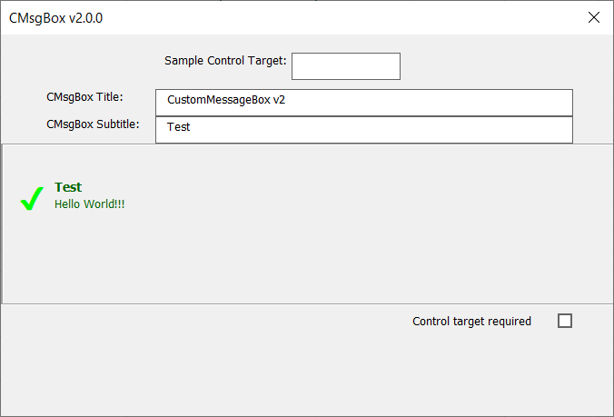

# CustomMsgboxClass

> Una Caja de Mensajes alterantiva en Excel, para aplicarse con VBA macros en UserForms.

## Definición
CustomMsgboxClass es un archivo de Clase VBA (.cls) con el que es fácil generar una rápida Caja de Mensajes y habilitarla sólo en Formularios (UserForms) con macros.

> Es necesario tener conocimientos básicos de programación de Clases VBA (POO, Programación Orientada a Objetos).

Trabaja bajo MS Excel versión 2007 o superior. No requiere instalación, sólo debe ser importardo a su Proyecto VBA.

Como CustomMsgboxClass es una Clase VBA, debe instanciarse como un objeto y luego usar su interfaz.

## Modo de uso
  1.  [Descargue el archivo CustomMsgboxClass_v2.cls](https://github.com/Roccouu/CustomMsgboxClass/tree/master/project-dist/CustomMsgboxClass_v2.cls).
  2.  Cree un nuevo libro habilitado para macros de Excel.
  3.  Abra el Editor de Proyectos VBA con **Ctrl+F11**
  4.  Vaya al menú ***Archivo > Importar Archivo*** o presione ***Ctrl+M*** y luego busque su archivo **CustomMsgboxClass_v2.cls** descargado e impórtelo al Proyecto VBA.
  5.  Puede crear un nuevo módulo y un nuevo formulario donde se utilizará ***CustomMsgboxClass*** (también puede descargar [custommsgboxexampleuse.xlsm](https://github.com/Roccouu/CustomMsgboxClass/tree/master/project-dist/custommsgboxexampleuse.xlsm) para ver algunos ejemplos prácticos de uso de ***CustomMsgboxClass***)
  6.  Llame a uno de los dos métodos del Objeto:
  ``` vb
    Dim msg As New CustomMsgboxClass

    Call msg.CMsgBox("Hello world!!!", "CustomMessageBox_v2", "Test", cMsgButtons:=cmbOKOnly, cUFrm:=Me)
  ```
  
  ``` vb
    Dim msg As New CustomMsgboxClass

    Call msg.CMsgBox("Hello world!!!", "CustomMessageBox_v2", "Test", cUFrm:=Me)
  ```
  
  ``` vb
    Dim msg As New CustomMsgboxClass

    Call msg.CMsgBox("Hello world!!!", "CustomMessageBox_v2", "Test", cmbSuccess, cUFrm:=Me, cAspect:=cmbFluid)
  ```
  
  ``` vb
    Dim msg As New CustomMsgboxClass

    Call msg.CMsgBox("Hello world!!!", "CustomMessageBox_v2", "Test", cUFrm:=Me, cAspect:=cmbTagLine)
  ```
  

  7.  ¡Disfrute de **CustomMsgboxClass**!

## A cerca de los dos métodos de CustomMsgboxClass
### CustomMsgboxClass Versión 2.0.0 (Recomendada)
  La segunda versión de ***CustomMsgboxClass*** tiene un nivel más alto de optimización.
  
  Ahora, la clase sólo contiene un método con todos sus parámetros opcionales:

  ***El método CMsgBox:*** Contiene catorce parámetros:
  - **cMsg** As String = VBA.vbNullString: El mensaje, una cadena de texto.
  - **cTitle** As String = "CustomMsgboxClass": El título, una cadena de texto.
  - **cSubtitle** As String = VBA.vbNullString, El subtítulo, una cadena de texto.
  - **cMsgType** As CMB_MsgType = cmbDefault: Una enumeración VBA que puede tomar cualquiera de los siguientes valores:   *cmbDefault, cmbError, cmbSuccess, cmbInfo, cmbQuestion, cmbAlert*, dependiendo de cuál sea elegido, CustomMsgboxClass mostrará un ícono respectivamente, el valor por defecto es *cmbDefault*, sin ícono.
  - **cMsgButtons** As CMB_ControlButtons = cmbNoButtons: Una enumeración VBA que puede tomar cualquiera de los siguientes valores: *cmbNoButtons, cmbOKOnly, cmbClose, cmbCancel*, permitirá mostrar un botón para una acción respectivamente. El valor por defecto es *cmbNoButtons*, sin botónes.
  - **cUFrm** As MSForms.UserForm: Un objeto UserForm donde residirá el objeto *CMsgbox*.
  - **cCtrlTargetName** As String = VBA.vbNullString: Una cadena. El nombre de un control, alrededor del cual se mostrará el objeto *CMsgBox* o lo resaltará dependiendo de su estatus.
  - **cCtrlSourceName** As String = VBA.vbNullString: Una cadena. El nombre del control, que invoca al objeto *CMsgBox*, usualmente un botón cuya visibilidad será bloqueada para evitar llamadas recursivas.
  - **cCtrlRequired** As CMB_ControlRequired = cmbNoRequired: Una enumeración VBA que puede tomar cualquiera de los siguientes valores: *cmbNoRequired, cmbRequired*, si el control *cCtrlTargetName* debe cumplir con la validación de un dato, el objeto *CMsgBox* hará que resalte de un color identificativo dependiendo de su estatus (error, info, etc.). El valor por defecto es *cmbNoRequired*, no requerido.
  - **cPositionX** As CMB_ControlPositionX = cmbCenter: Una enumeración VBA que puede tomar cualquiera de los siguientes valores: *cmbCenter, cmbLeft, cmbRight*, ordena al objeto *CMsgBox* posicionarse en el eje horizontal a la izquierda, derecha o centro del formulario o alrededor del control *cCtrlTargetName*. El valor por defecto es *cmbCenter*, al centro.
  - **cPositionY** As CMB_ControlPositionY = cmbMiddle: Una enumeración VBA que puede tomar cualquiera de los siguientes valores: *cmbMiddle, cmbTop, cmbBottom*, ordena al objeto *CMsgBox* posicionarse en el eje vertical arriba, abajo o al medio del formulario o alrededor del control *cCtrlTargetName*. El valor por defecto es *cmbMiddle*, al medio.
  - **cTheme** As CMB_ColorIndex = cmbGreenDefault: Una enumeración VBA que puede tomar cualquiera de los siguientes valores: *cmbGreenDefault, cmbPurple, cmbMaroon, cmbBlack*, ordena al objeto *CMsgBox* que adopte el tema de colores seleccionado. El valor por defecto es *cmbGreenDefault*, verde *CMsgBox*.
  - **cDuration** As CMB_MsgDuration = cmbNoTime: Una enumeración VBA que puede tomar cualquiera de los siguientes valores: *cmbNoTime, cmb3Seconds, cmb4Seconds, cmb5Seconds*, ordena al objeto *CMsgBox* que se muestre un tiempo limitado, el mínimo 3 segundos. El valor por defecto es *cmbNoTime*, asíncrono. *Cuando *CMsgBox* tiene un tiempo determinado, ningún botón podrá ser mostrado en su interfaz.*
  - **cAspect** As CMB_MsgBoxAspect = cmbPopupDefault: Una enumeración VBA que puede tomar cualquiera de los siguientes valores: *cmbPopupDefault, cmbPopupAutoclose, cmbFluid, cmbTagLine*, ordena al objeto *CMsgBox* que muestre una interfaz determinada. *cmbPopupDefault*: una interfaz fija y asíncrona, *cmbPopupAutoclose*: una interfaz flotante y síncrona, por defecto 3 segundos, *cmbFluid*: una interfaz fluida a lo ancho del formulario y síncrona, por defecto 3 segundos, *cmbTagLine*: una interfaz flotante síncrona o asíncrona cuyo aspecto es el de una etiqueta al lado de un control *cCtrlTargetName*.

---
### CustomMsgboxClass Versión 1.0.0
  A. ***El Método CMsgbox:*** Permite crear un Objeto Caja de Mensaje tipo ventana, éste objeto puede mostrarse en un formulario de modo ***asíncrono*** (sín límite de tiempo) o ***síncrono*** (por un tiempo establecido); el modo asíncrono despliega un botón que permite al Usuario cerrar la ventana cuando él lo decida, con el modo síncrono, la ventana se cierra tras haber trasncurrido un tiempo establecido por el desarrollador (por defecto se muestra durante tres segundos y como máximo puede mostrarse durante diez segundos) sín mostrar el botón de cerrar ventana.
  El método tiene varios parámetros, la mayoría opcionales:
  ```vb
    CMsgbox( _
      ByVal MFrm As MSForms.UserForm, _
      Optional MMsg As String = "", _
      Optional MMsgType As String = "", _
      Optional MTitle As String = "CustomMsgboxClass", _
      Optional MSubtitle As String = "", _
      Optional MCloseButton As Boolean = False, _
      Optional MPosition As String = "Middle", _
      Optional MControl As Object, _
      Optional MRequiredControl As Boolean = False, _
      Optional MColor As Long = 4616993, _
      Optional MTime As Single = 3)
  ```
  Donde:

  1.  **Mfrm: (Requerido)** Debe ser un Objeto tipo UserForm donde la Caja de Mensaje se desplegará.
  2.  **MMsg:** Es el mensaje principal que se desea mostrar, es decir, el contenido. El valor por defecto es una cadena vacía.
  3.  **MMsgType:** Es el tipo de Caja de Mensaje que se desea mostrar. Existen cinco tipos posibles:
        -  "Error": Para mostrar mensajes de error.
        -  "Success": Para mostrar mensajes de resultados correctos.
        -  "Info": Para mostrar mensajes de información.
        -  "Question": Para mostrar mensajes de interrogación.
        -  "Alert": Para mostrar mensajes de alerta.
        -  El tipo por defecto sólo utiliza los colores del sistema, sín íconos ni barra de título.
  4.  **MTitle:** El título del mensaje, se ve en la zona de barra de título de la Caja de Mensaje. Valor por defecto: "CustomMsgboxClass".
  5.  **MSubtitle:** Un subtítulo opcional para el mensaje. Cadena vacía como valor por defecto.
  6.  **MCloseButton:** Valor booleano, en verdadero, muestra un botón de cerrar ventana; sólo trabaja en caso ***asíncrono***. Por defecto es Falso.
  7.  **MPosition:** Parámetro tipo cadena. Es la posición del Objeto en el área del Formulario, existen tres posibles posiciones: *"Top"*, muestra el Objeto en la parte superior, *"Middle"*, al medio, y *"Bottom"*, en la parte inferior del Formularrio. Valor por defecto: *"Middle"*.
  8.  **MControl:** Objeto tipo MSForms.Control. En caso de que desee resaltar un control de entrada de datos del Formulario, envíe en *MControl* el Control de su Formulario que desee resaltar (El Objeto trabaja con controles de tipo TextBox, ComboBox, ListBox, RefEdit y Label), *CustomMsgBox* se mostrará justo debajo y alineado a la izquierda del control que asigne (*MPosition* será ignorado), además el control cambiará de color de fondo y borde durante unos segundos, dependiendo del tipo de Caja de Mensaje que haya establecido y de haber confirmado que quiere resaltar el control indicado, luego los estilos de dicho control retornarán a su estado original. Valor por defecto: Nothing.
  9.  **MRequiredControl:** Booleano. Establezca su valor en Verdadero para confirmar que desea resaltar el control enviado en *MControl*. Valor por defecto: Falso.
  10. **MColor:** Tipo de dato Entero Largo (Long). Permite establecer un color de tema para la Caja de Mensaje, puede utilizar un número tipo entero largo ó la functión VBA.RGB(RR,GG,BB) que determine el color de tema que desee para el Objeto. Valor por defecto: 4616993 (VBA.RGB(33, 115, 70), color verde de la Aplicación Excel)
  11. **MTime:** Entero Sencillo. Un valor entre 3 y 10 que permite establecer un tiempo personalizado para mostrar el Obejto Caja de Mensaje, luego de transcurrido ese tiempo, el Objeto se cerrará y autodestruirá del Formulario.

  B. ***El Método CMsgboxFluid:*** Permite crear un Objeto Caja de Mensaje tipo cinta (fluido, expandido en todo el ancho del Formulatio), éste objeto puede mostrarse en un formulario sólo de modo ***síncrono*** (por un tiempo establecido).
  El método tiene varios parámetros, la mayoría opcionales:
  ```vb
    CMsgboxFluid( _
      ByVal MFrm As MSForms.UserForm, _
      Optional MMsg As String = "", _
      Optional MMsgType As String = "", _
      Optional MSubtitle As String = "CustomMsgboxClass", _
      Optional MPosition As String = "Middle", _
      Optional MControl As Object, _
      Optional MRequiredControl As Boolean = False, _
      Optional MColor As Long = 4616993, _
      Optional MTime As Single = 3)
  ```
  Donde:

  1.  **Mfrm: (Requerido)** Debe ser un Objeto tipo UserForm donde la Caja de Mensaje se desplegará.
  2.  **MMsg:** Es el mensaje principal que se desea mostrar, es decir, el contenido. El valor por defecto es una cadena vacía.
  3.  **MMsgType:** Es el tipo de Caja de Mensaje que se desea mostrar. Existen cinco tipos posibles:
      -  "Error": Para mostrar mensajes de error.
      -  "Success": Para mostrar mensajes de resultados correctos.
      -  "Info": Para mostrar mensajes de información.
      -  "Question": Para mostrar mensajes de interrogación.
      -  "Alert": Para mostrar mensajes de alerta.
      -  El tipo por defecto sólo utiliza los colores del sistema, sín íconos ni Subtítulo.
  4.  **MSubtitle:** Un subtítulo opcional para el mensaje. Cadena vacía como valor por defecto.
  5.  **MPosition:** Parámetro tipo cadena. Es la posición del Objeto en el área del Formulario, existen tres posibles posiciones: *"Top"*, muestra el Objeto en la parte superior, *"Middle"*, al medio, y *"Bottom"*, en la parte inferior del Formularrio. Valor por defecto: *"Middle"*.
  6.  **MControl:** Objeto tipo MSForms.Control. En caso de que desee resaltar un control de entrada de datos del Formulario, envíe en *MControl* el Control de su Formulario que desee resaltar (El Objeto trabaja con controles de tipo TextBox, ComboBox, ListBox, RefEdit y Label), *CustomMsgBox* se mostrará justo debajo y alineado a la izquierda del control que asigne (*MPosition* será ignorado), además el control cambiará de color de fondo y borde durante unos segundos, dependiendo del tipo de Caja de Mensaje que haya establecido y de haber confirmado que quiere resaltar el control indicado, luego los estilos de dicho control retornarán a su estado original. Valor por defecto: Nothing.
  7.  **MRequiredControl:** Booleano. Establezca su valor en Verdadero para confirmar que desea resaltar el control enviado en *MControl*. Valor por defecto: Falso.
  8. **MColor:** Tipo de dato Entero Largo (Long). Permite establecer un color de tema para la Caja de Mensaje, puede utilizar un número tipo entero largo ó la functión VBA.RGB(RR,GG,BB) que determine el color de tema que desee para el Objeto. Valor por defecto: 4616993 (VBA.RGB(33, 115, 70), color verde de la Aplicación Excel)
  9. **MTime:** Entero Sencillo. Un valor entre 3 y 10 que permite establecer un tiempo personalizado para mostrar el Obejto Caja de Mensaje, luego de transcurrido ese tiempo, el Objeto se cerrará y autodestruirá del Formulario.

## Colaborar en GitHub:
El código fuente de **CustomMsgboxClass** está en: [el directorio project-dev](https://github.com/Roccouu/CustomMsgboxClass/tree/master/project-dev/CustomMsgboxClass_v2.cls) del repositorio oficial.

Tan pronto como se descargue, puede colaborar con mejoras en el Sistema siempre bajo el respeto de [Términos de licencia](https://github.com/Roccouu/CustomMsgboxClass/blob/master/LICENSE), [El Código de Conducta](https://github.com/Roccouu/CustomMsgboxClass/blob/master/CODE_OF_CONDUCT.md) y los [Términos de Contribución](https://github.com/Roccouu/CustomMsgboxClass/blob/master/CONTRIBUTING.md).

## Sitio Web

[CustomMsgboxClass](https://roccouu.github.io/CustomMsgboxClass/docs/index.html)

## Tutorial

[Tutorial CustomMsgboxClass](https://roccouu.github.io/CustomMsgboxClass/docs/index.html#/tutorial)

## Documentación

[Documentación CustomMsgboxClass](https://roccouu.github.io/CustomMsgboxClass/index.html#/docs/index.html#/documentation)

## Contribución

Vea las [Guías de CONTRIBUCIÓN](https://github.com/roccouu/CustomMsgboxClass/CONTRIBUTING.md)

## English Readme

[README-EN.md](https://github.com/roccouu/CustomMsgboxClass/blob/master/README-EN.md)

## Licencia

[MIT](https://github.com/roccouu/CustomMsgboxClass/blob/master/LICENSE) © | [E-Mail](rocky.romay@gmail.com) | [Roccou](https://www.linkedin.com/in/roberto-carlos-romay-medina/) | 2021